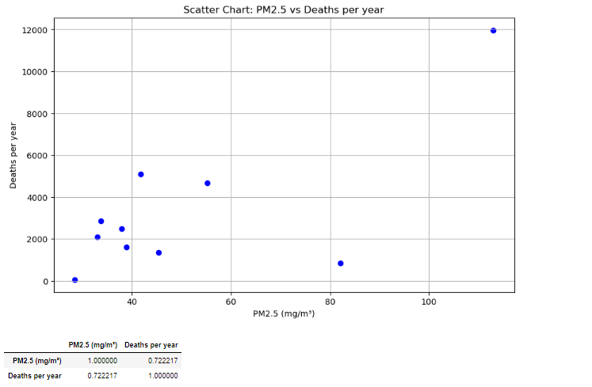
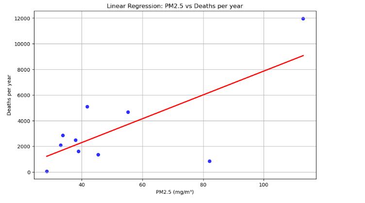
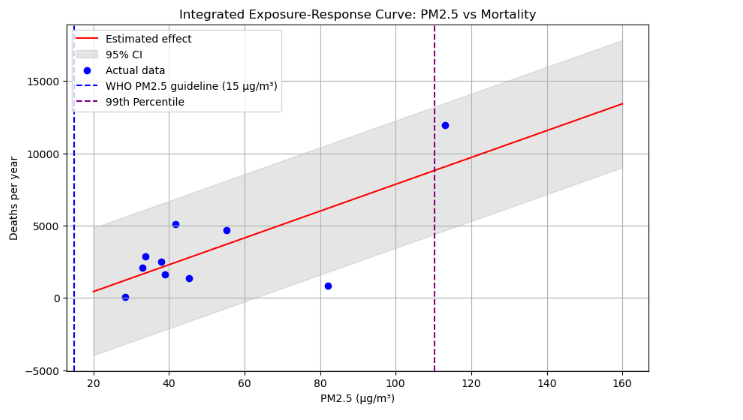
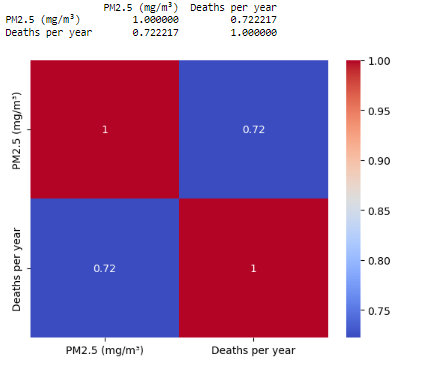
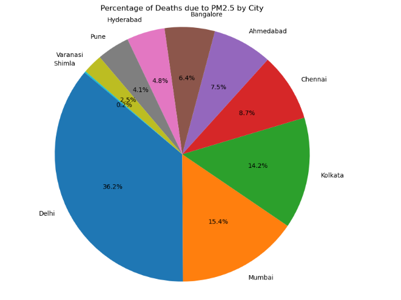
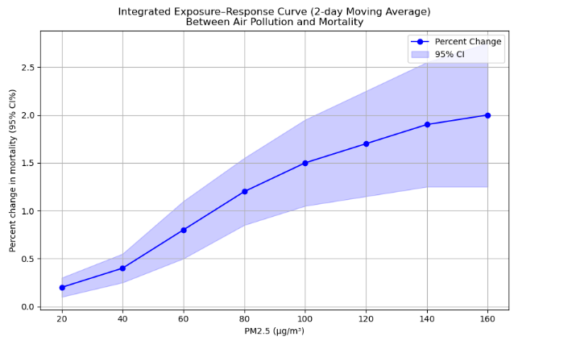

# Analysis-Based-On-Lancet-Report
> **Brief Description:** - Our amanalysis based on Lancet report

## Table of Contents

- [Description](#description)
- [Plots](#plots)
- [Contribution](#contributipn)
- [Contact Details](#contact-details)

---

## Description

**Chapter 1 of the "India TB Report 2023" details the organizational structure and functioning of the National Tuberculosis Elimination Programme (NTEP). The NTEP is implemented under the National Health Mission (NHM) with shared resources from the Central and State Governments.**

## Plots
### Data collected form Lancet report
```Python
import numpy as np
import pandas as pd
import matplotlib.pyplot as plt
from sklearn.linear_model import LinearRegression

# Your data
data = {
    "City": ["Delhi", "Mumbai", "Kolkata", "Chennai", "Ahmedabad", "Bangalore", "Hyderabad", "Pune", "Varanasi", "Shimla"],
    "PM2.5 (mg/m³)": [113.0, 41.7, 55.2, 33.7, 37.9, 33.0, 38.9, 45.3, 82.1, 28.4],
    "Deaths per year": [11964, 5091, 4678, 2870, 2495, 2102, 1597, 1367, 831, 59]
}

# Creating DataFrame
df = pd.DataFrame(data)

```
## Generating a Scatter chart
```python

# Plotting scatter chart
plt.figure(figsize=(10, 6))
plt.scatter(df["PM2.5 (mg/m³)"], df["Deaths per year"], color='b')
plt.title('Scatter Chart: PM2.5 vs Deaths per year')
plt.xlabel('PM2.5 (mg/m³)')
plt.ylabel('Deaths per year')
plt.grid(True)
plt.show()

# Calculating correlation
df.corr(method='pearson', numeric_only=True, min_periods=1)

correlation
```


### Generating a linear regression plot
```python
import seaborn as sns

# Plotting linear regression plot
plt.figure(figsize=(10, 6))
sns.regplot(x=df["PM2.5 (mg/m³)"], y=df["Deaths per year"], ci=None, scatter_kws={'color':'blue'}, line_kws={'color':'red'})
plt.title('Linear Regression: PM2.5 vs Deaths per year')
plt.xlabel('PM2.5 (mg/m³)')
plt.ylabel('Deaths per year')
plt.grid(True)
plt.show()
```


## Displaying a shaded area for 95% connfidence interval
```python
# Convert to numpy arrays for modeling
pm25 = np.array(data["PM2.5 (mg/m³)"]).reshape(-1, 1)
deaths = np.array(data["Deaths per year"])

# Fit linear regression model
model = LinearRegression()
model.fit(pm25, deaths)
deaths_pred = model.predict(pm25)

# Generate new PM2.5 range for plotting
pm25_range = np.linspace(20, 160, 100).reshape(-1, 1)
deaths_pred_range = model.predict(pm25_range)

# Calculate residuals and standard deviation
residuals = deaths - model.predict(pm25)
residual_std = np.std(residuals)

# Calculate confidence intervals for new predictions
confidence_interval = 1.96 * residual_std
ci_upper = deaths_pred_range + confidence_interval
ci_lower = deaths_pred_range - confidence_interval

# Plotting
plt.figure(figsize=(10, 6))
plt.plot(pm25_range, deaths_pred_range, color='red', label='Estimated effect')
plt.fill_between(pm25_range.flatten(), ci_lower.flatten(), ci_upper.flatten(), color='gray', alpha=0.2, label='95% CI')
plt.scatter(pm25, deaths, color='blue', label='Actual data')
plt.axvline(x=15, color='blue', linestyle='--', label='WHO PM2.5 guideline (15 µg/m³)')
plt.axvline(x=np.percentile(pm25, 99), color='purple', linestyle='--', label='99th Percentile')

plt.title('Integrated Exposure-Response Curve: PM2.5 vs Mortality')
plt.xlabel('PM2.5 (µg/m³)')
plt.ylabel('Deaths per year')
plt.legend()
plt.grid(True)
plt.show()
```


### Interpretation with main Points from the Graph

#### Title and Axes:
- The graph is titled "Integrated Exposure-Response Curve: PM2.5 vs Mortality".
- The x-axis represents PM2.5 concentrations in micrograms per cubic meter (µg/m³).
- The y-axis represents the number of deaths per year.

#### Data Points (Blue Dots):
- The blue dots represent the actual data points from various cities, showing the number of deaths per year at different levels of PM2.5.
#### Estimated Effect (Red Line):
- The red line represents the estimated effect of PM2.5 on mortality, based on the linear regression model.
- It shows a positive relationship, indicating that as PM2.5 levels increase, the number of deaths per year also increases.

#### Confidence Interval (Gray Shaded Area):
- The gray shaded area around the red line represents the 95% confidence interval (CI) of the estimated effect.
- This area indicates the range within which the true effect is likely to lie with 95% certainty.
- The wider the shaded area, the greater the uncertainty in the estimate.

#### WHO PM2.5 Guideline (Blue Dashed Line):
- The blue dashed line at 15 µg/m³ represents the World Health Organization (WHO) guideline for safe PM2.5 exposure levels.
- This guideline is significantly lower than the observed PM2.5 levels in the data.

#### 99th Percentile (Purple Dashed Line):
- The purple dashed line marks the 99th percentile of PM2.5 concentrations in the dataset.
- This line indicates that 99% of the PM2.5 measurements were below this level.

#### Interpretation of the Graph
- Positive Correlation: The graph shows a clear positive correlation between PM2.5 levels and mortality, meaning that higher - - PM2.5 levels are associated with a higher number of deaths per year.

**Significance of Confidence Interval** : The confidence interval indicates the degree of certainty around the estimated effect. A narrower interval would suggest more precise estimates, whereas a wider interval indicates greater uncertainty.

**Public Health Implication**: The fact that the observed PM2.5 levels in the data are well above the WHO guideline highlights the significant public health risk posed by air pollution in these cities.

**Policy Relevance**: This graph underscores the need for stricter air quality standards and effective pollution control measures to reduce PM2.5 levels and improve public health outcomes.

In summary, the integrated exposure-response curve visually and quantitatively demonstrates the significant impact of PM2.5 on mortality, emphasizing the urgent need for policies aimed at reducing air pollution levels.

### Calculating the correlation matrix
```python
import seaborn as sns
import matplotlib.pyplot as plt

# Calculating correlation
correlation = df.corr(numeric_only=True)

print(correlation)

# Create a heatmap
sns.heatmap(correlation, annot=True, cmap='coolwarm')
plt.show()
```


### Interpretation of the graph showing the heatmap 
- There is a positive correlation of .72 between **PM2.5** levels and **Number of deaths recorded per year**
- This conforms to the other plots shown above.


## Generating Pie Chart to understand distribution
```python
# Calculating the percentage of deaths due to PM2.5 for each city
total_deaths = df["Deaths per year"].sum()
df["Percentage of deaths"] = (df["Deaths per year"] / total_deaths) * 100

# Plotting pie chart
plt.figure(figsize=(10, 8))
plt.pie(df["Percentage of deaths"], labels=df["City"], autopct='%1.1f%%', startangle=140)
plt.title('Percentage of Deaths due to PM2.5 by City')
plt.axis('equal')  # Equal aspect ratio ensures that pie is drawn as a circle.
plt.show()
```


### Interpretation of the pie chart 
- Delhi, Mumbai and Kolkata are the worst affected areas
- They cover almost 2/3rd of the totsl number of deaths caused by PM2.5 pollution effect.

### Collecting data for percentage change (extracted from data)
```python
import matplotlib.pyplot as plt
import numpy as np

# Data for the plot extracted from the document
pm25 = np.array([20, 40, 60, 80, 100, 120, 140, 160], dtype='float64')
percent_change = np.array([0.2, 0.4, 0.8, 1.2, 1.5, 1.7, 1.9, 2.0], dtype='float64')  # Example data points
ci_lower_bound = percent_change - np.array([0.1, 0.15, 0.3, 0.35, 0.45, 0.55, 0.65, 0.75], dtype='float64')
ci_upper_bound = percent_change + np.array([0.1, 0.15, 0.3, 0.35, 0.45, 0.55, 0.65, 0.75], dtype='float64')
```
### Integrated Exposure-Response (2-day Moving Average)
```python
# Create the plot
plt.figure(figsize=(10, 6))
plt.plot(pm25, percent_change, marker='o', linestyle='-', color='b', label='Percent Change')
plt.fill_between(pm25, ci_lower_bound, ci_upper_bound, color='b', alpha=0.2, label='95% CI')

# Add labels and title
plt.xlabel("PM2.5 (µg/m³)")
plt.ylabel("Percent change in mortality (95% CI%)")
plt.title("Integrated Exposure–Response Curve (2-day Moving Average)\nBetween Air Pollution and Mortality")
plt.legend()
plt.grid(True)
plt.show()
```


### Interpretation
The plot demonstrates that short-term exposure to PM2.5 is associated with an increased risk of mortality, even at concentrations below the current Indian standard of 60 µg/m³. The steep slope at lower levels of PM2.5 exposure indicates that reducing PM2.5 concentrations, even slightly, can have significant public health benefits by reducing mortality rates.

## Program-codes


The programs are written on jupiter notebook, You may run the program on Google colab by clicking on the colab badge below. However, the output may not be generated on colab. For that you have to download the program and run it locally. Make sure that the packages are all installed.

[](https://colab.research.google.com/github/fromsantanu/NTBRS-Chapter-1/blob/main/NTBRS-Chapter-1.ipynb)

## Contribution

The reports and programs are written by Santanu Karmakar

## Contact-details

If you wish to contact me, please leave a message (Preferably WhatsApp) on this number: 6291 894 897.
Please also mention why you are contacting me. Include your name and necessary details.
Thank you for taking an interest.
